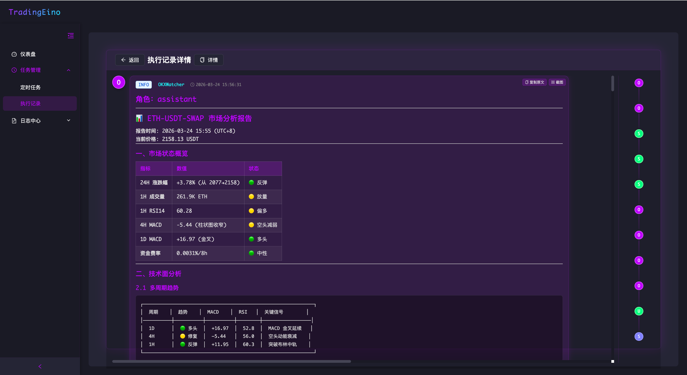

# TradingEino

[](https://opensource.org/licenses/Apache-2.0)
[](https://go.dev)
[](https://github.com/cloudwego/eino)
[](https://github.com/PineappleBond/TradingEino/releases)

[中文版本](./README-ZH.md)

---

## Overview

TradingEino is an AI-powered multi-agent cryptocurrency trading system built on the Cloudwego Eino framework. It monitors OKX exchange markets, performs technical and sentiment analysis, and executes trades autonomously with built-in risk management.



## Core Features

- **Multi-Agent Architecture** - DeepAgent coordinator (OKXWatcher) orchestrating specialized sub-agents for technical analysis, sentiment analysis, position management, and trade execution
- **OKX Exchange Integration** - Full REST API support for market data, account management, and trading operations with rate limiting
- **Technical Analysis** - 20+ built-in indicators (MACD, RSI, Bollinger Bands, KDJ, ATR) via K-line data analysis
- **Sentiment Analysis** - Funding rate monitoring and market sentiment evaluation
- **Risk Management** - Independent risk monitoring layer with position tracking, margin ratio alerts, and liquidation price monitoring
- **RAG Decision Memory** - Redis Stack + m3e-base embedding for historical decision storage and retrieval (planned)
- **Web Interface** - Embedded SPA frontend accessible at `http://localhost:10098`

## Architecture

```
┌─────────────────────────────────────────────────────────┐
│         OKXWatcher (DeepAgent - Coordinator)            │
│  Trigger: Scheduled / Price Alert                       │
│  Role: Market Analysis, Strategy Generation, Routing    │
└─────────────┬───────────────────────────────────────────┘
              │
    ┌─────────┼──────────────────────┬────────────────────────┐
    │         │                      │                        │
┌───▼───┐ ┌──▼──────┐ ┌────────────▼────────┐ ─────▼──────┐
│Techno │ │Sentiment│ │   PositionManager   │ │  Executor  │
│       │ │Analyst  │ │                     │ │  (Level 1) │
└───────┘ └───────── └───────────────────── └────────────┘
```

### Agent Responsibilities

| Agent                | Type                    | Tools                                                                                                     | Output                                                |
|----------------------|-------------------------|-----------------------------------------------------------------------------------------------------------|-------------------------------------------------------|
| **OKXWatcher**       | DeepAgent (Coordinator) | None (orchestrates sub-agents)                                                                            | Market analysis, strategy, execution commands         |
| **TechnoAgent**      | ChatModelAgent          | `okx-candlesticks-tool`                                                                                   | Trend analysis, support/resistance, indicator signals |
| **SentimentAnalyst** | ChatModelAgent          | `okx-get-funding-rate-tool`                                                                               | Funding rate analysis, market sentiment               |
| **PositionManager**  | ChatModelAgent          | `okx-get-positions-tool`, `okx-get-orders-tool`, `okx-account-balance-tool`, `okx-liquidation-price-tool` | Position risk, PnL, margin alerts                     |
| **Executor**         | ChatModelAgent          | `okx-place-order-tool`, `okx-cancel-order-tool`, `okx-get-order-tool`, `okx-close-position-tool`          | Trade execution (Level 1 autonomy)                    |

## Tech Stack

| Component                    | Technology                                                 |
|------------------------------|------------------------------------------------------------|
| **Language**                 | Go 1.26.1                                                  |
| **AI Framework**             | Cloudwego Eino v0.8.4                                      |
| **Web Framework**            | Gin v1.12.0                                                |
| **Database**                 | SQLite3 (pure Go, no CGO)                                  |
| **ORM**                      | GORM v1.31.1                                               |
| **Configuration**            | Viper v1.21.0                                              |
| **Scheduler**                | robfig/cron/v3                                             |
| **Technical Analysis**       | go-talib  (plan to replaced by github.com/cinar/indicator) |
| **Rate Limiting**            | golang.org/x/time/rate                                     |
| **Vector Storage** (planned) | Redis Stack + RediSearch                                   |
| **Embedding** (planned)      | Ollama + m3e-base                                          |

## Project Structure

```
TradingEino/
├── backend/                   # Backend server (Go + Eino)
│   ├── cmd/
│   │   └── server/            # Application entry point
│   ├── internal/
│   │   ├── agent/             # Multi-agent system
│   │   ├── api/               # HTTP API layer
│   │   ├── config/            # Configuration loading
│   │   ├── logger/            # Structured logging
│   │   ├── model/             # GORM models
│   │   ├── repository/        # Data access layer
│   │   ├── scheduler/         # Task scheduling
│   │   ├── service/           # Business logic
│   │   └── svc/               # Service context (DI)
│   ├── pkg/
│   │   └── okex/              # OKX API client
│   ├── web/                   # Embedded frontend (SPA)
│   ├── etc/
│   │   └── config.yaml        # Application config
│   └── README.md              # Backend documentation
├── frontend/                  # Frontend source (Vue 3)
├── docs/                      # Documentation assets
└── .planning/                 # Project documentation
    ├── PROJECT.md             # Project vision
    ├── REQUIREMENTS.md        # Requirements tracking
    └── ROADMAP.md             # Development roadmap
```

## Getting Started

### Prerequisites

- Go 1.26.1 or later
- OKX API credentials (API Key, Secret Key, Passphrase)
- LLM API access (DashScope/Aliyun or OpenAI-compatible)

### Installation

```bash
# Clone repository
git clone https://github.com/PineappleBond/TradingEino.git
cd TradingEino/backend

# Install dependencies
go mod download

# Configure application
cp etc/config.example.yaml etc/config.yaml
# Edit etc/config.yaml with your OKX credentials and API keys

# Build
go build -o server ./cmd/server

# Run
./server
```

The web interface will be available at `http://localhost:10098`

### Configuration

| Setting              | Description          | Default             |
|----------------------|----------------------|---------------------|
| `server.port`        | HTTP server port     | 10098               |
| `okx.api_key`        | OKX API key          | -                   |
| `okx.secret_key`     | OKX secret key       | -                   |
| `okx.passphrase`     | OKX passphrase       | -                   |
| `okx.sandbox`        | Use OKX sandbox      | true                |
| `chatmodel.endpoint` | LLM API endpoint     | Aliyun DashScope    |
| `chatmodel.api_key`  | LLM API key          | -                   |
| `db.type`            | Database type        | sqlite              |
| `db.path`            | SQLite database path | data/TradingEino.db |

## Roadmap

| Phase       | Goal                                                                              | Status         |
|-------------|-----------------------------------------------------------------------------------|----------------|
| **Phase 1** | Foundation & Safety (error handling, rate limiting, singleton, graceful shutdown) | ✅ Complete     |
| **Phase 2** | Analysis Layer (refactor sub-agents to ChatModelAgent)                            | ✅ Complete     |
| **Phase 3** | Execution Automation (trading tools, Executor Agent Level 1)                      | ✅ Complete     |
| **Phase 4** | RAG Memory (Redis Stack, decision save/search)                                    | ⏳ Planned      |

## v1.0.0 Completed Features

✅ **Full Trading Loop Implemented**:
- Scheduled Task Trigger → OKXWatcher → Multi-Agent Analysis → OKXWatcher Summary → ExecutorAgent Execution
- Technical Analysis Agent (TechnoAgent) - 20+ indicators
- Sentiment Analysis Agent (SentimentAnalyst) - Funding rate analysis
- Position Management Agent (PositionManager) - Risk assessment
- Execution Agent (ExecutorAgent) - Level 1 autonomous trading

## Key Decisions (ADR)

| Decision                        | Rationale                                                  | Status     |
|---------------------------------|------------------------------------------------------------|------------|
| DeepAgent only for OKXWatcher   | Avoids hierarchy redundancy, sub-agents use ChatModelAgent | ✅ Approved |
| Analysis/Execution separation   | Clean audit trail, independent testing                     | ✅ Approved |
| Tool atomic design              | Each tool does one thing well                              | ✅ Approved |
| RAG with Redis Stack + m3e-base | Local embedding, no external API dependency                | ✅ Approved |
| Independent RiskMonitor layer   | Real-time monitoring, can override decisions               | ✅ Approved |
| Executor starts at Level 1      | Only execute explicit commands, earn autonomy over time    | ✅ Complete |

## Safety Features

- **Rate Limiting** - All API tools have conservative rate limits (5 req/s for trading endpoints)
- **Error Handling** - Proper error propagation (returns `"", err` pattern)
- **Context Propagation** - Cancellation works end-to-end
- **Singleton Pattern** - Thread-safe agent initialization with `sync.Once`
- **Graceful Shutdown** - Proper resource cleanup on exit (Server → Scheduler → Agents → DB)
- **Executor Level 1** - Only executes explicit commands from coordinator

## API Endpoints

| Endpoint             | Method              | Description          |
|----------------------|---------------------|----------------------|
| `/api/v1/health`     | GET                 | Health check         |
| `/api/v1/cron/tasks` | GET/POST/PUT/DELETE | Cron task management |
| `/`                  | GET                 | Web frontend (SPA)   |

## Available Tools

| Tool                   | Purpose                      | Rate Limit |
|------------------------|------------------------------|------------|
| `okx-candlesticks`     | K-line data + 20+ indicators | 10 req/s   |
| `okx-get-positions`    | Query current positions      | 5 req/s    |
| `okx-get-funding-rate` | Funding rate data            | 10 req/s   |
| `okx-place-order`      | Place market/limit order     | 5 req/s    |
| `okx-cancel-order`     | Cancel pending order         | 5 req/s    |
| `okx-get-order`        | Query order status           | 10 req/s   |
| `okx-close-position`   | Close position               | 5 req/s    |

## License

TradingEino is released under the [Apache License 2.0](LICENSE).

---

## Contributing

1. Fork the repository
2. Create your feature branch (`git checkout -b feature/amazing-feature`)
3. Commit your changes (`git commit -m 'Add amazing feature'`)
4. Push to the branch (`git push origin feature/amazing-feature`)
5. Open a Pull Request

## Disclaimer

> ⚠️ **IMPORTANT NOTICE**
>
> - **This project is for educational and learning purposes only**, designed to demonstrate how to build a trading system using AI multi-agent architecture
> - **No comprehensive backtesting has been performed**, and strategy performance in live trading environments has not been validated
> - **Not suitable for production use**, as it lacks complete risk management, fault tolerance, and security audits
> - Cryptocurrency trading involves substantial risk of loss. **Do NOT use this software in live trading environments**
> - The developers are not liable for any direct, indirect, incidental, or consequential damages resulting from the use or inability to use this software
> - For testing purposes, always use the OKX sandbox environment for thorough validation
>
> **By using this software, you agree to use it solely for educational and research purposes. Any live trading activities are undertaken entirely at your own risk.**